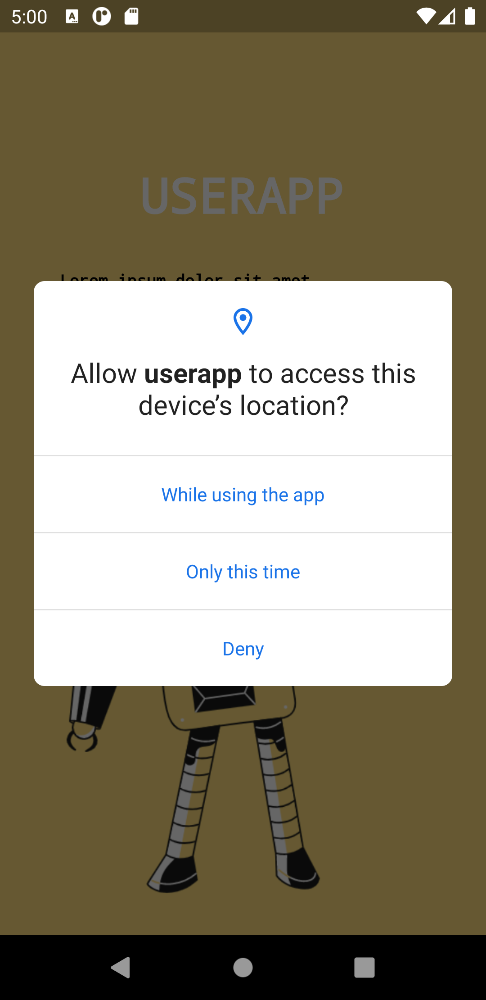
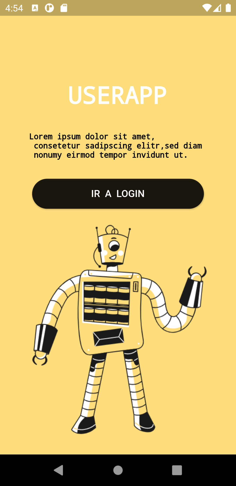
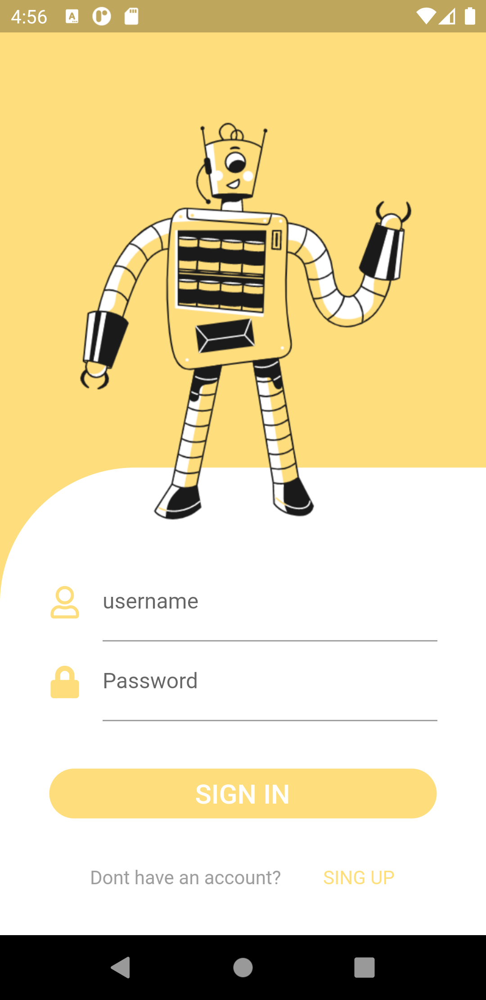
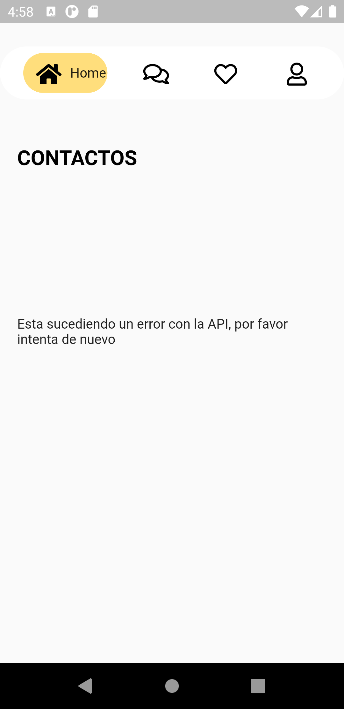

# userapp

A new Flutter project.

## Getting Started

This project is a starting point for a Flutter application.

A few resources to get you started if this is your first Flutter project:

- [Lab: Write your first Flutter app](https://flutter.dev/docs/get-started/codelab)
- [Cookbook: Useful Flutter samples](https://flutter.dev/docs/cookbook)

For help getting started with Flutter, view our
[online documentation](https://flutter.dev/docs), which offers tutorials,
samples, guidance on mobile development, and a full API reference.

# UsetApp test
ESta es una aplicacion construida en flutter la cual es un inicio de sesion con tres vistas:

Splash : Muestra un splash y solicita perimisos de ubicacion, de ser acepado podra redirigirse al login, del contrario muestra mensaje de error.
Login : Valida el username y phone para un usuario, si esta logeado lo redirige a home, de no ser asi, muestra un mensaje de error.
Home : Muestra un  lista de contactos del usario con su foto de un album, username y email.
1. Contiene un llamdo a los permisos de ubicacion.
2. Consume los servicios de graphQl
3. Utiliza patrones de desarrollo se utilizaron BLOC y PROVIDER.
4. Tiene prefrencias compartidas, para un logeo unico.

Finalmente esta app es realizada solo para fines demostrativos.

# Screenshots
{:height="20%" width="20%"}
{:height="20%" width="20%"}

# Información Personal

=100x20
**Nombre**: Jeisson Santacruz.
**Profesion **: Ingeniero de sistemas y ciencias de la computacion.
** Tecnologias** : Flutter, React Native, PHP, Node js, JavaScript, GraphQl.
** Contacto** : jeissonsanta132@gmail.com

#  ¿Por qué Flutter?

